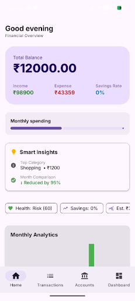
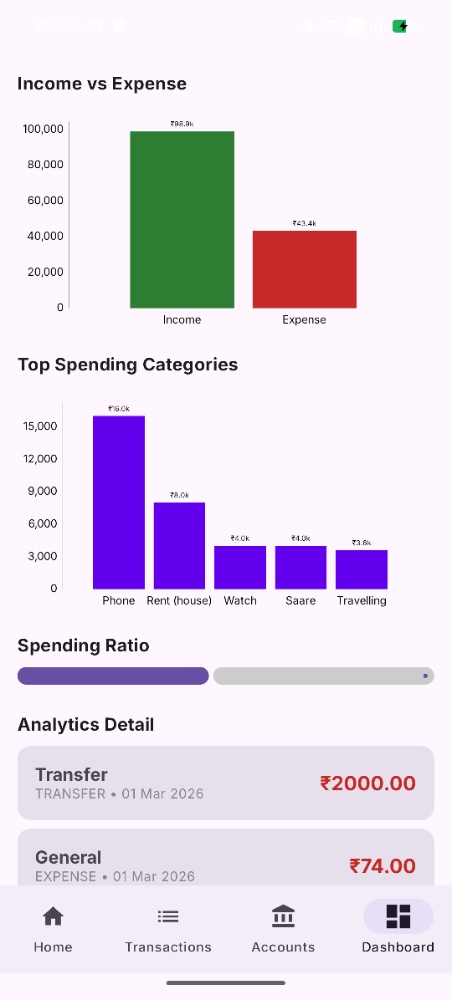
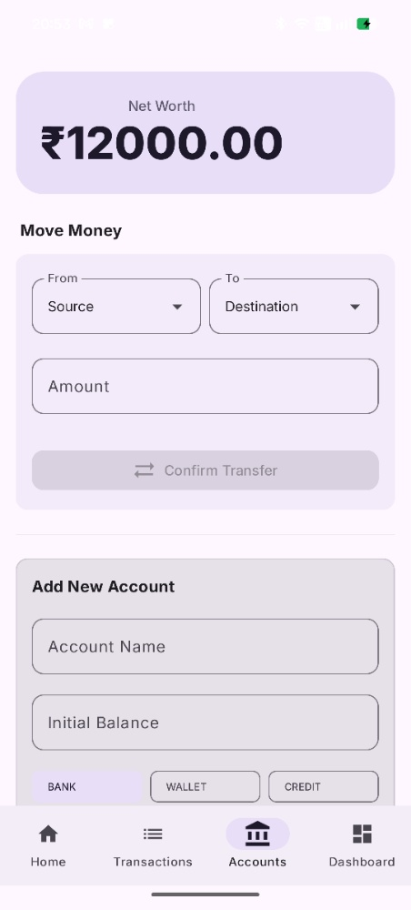

# 💰 FinFlow — Smart Personal Finance Tracker

**FinFlow** is a modern, high-performance Android fintech application designed to help users manage their personal finances with precision and ease. Built entirely with **Jetpack Compose** and following **Material 3** design guidelines, FinFlow offers a seamless, intuitive experience for tracking income, expenses, and internal transfers using a robust ledger-based accounting system.

---

## 🚀 Key Features

- **Double-Entry Ledger System:** Ensures 100% data integrity by treating every transaction as a ledger entry.
- **Smart SMS/Email Parsing:** A specialized tool to quickly "Scan Content" from bank alerts to automate transaction entry.
- **Multi-Account Management:** Manage Bank accounts (HDFC, BOB, etc.), Wallets, and Credit Cards in one unified interface.
- **Real-time Derived Balances:** Balances are calculated dynamically from transaction history to prevent "balance drift."
- **Financial Health Analytics:** High-fidelity charts (MPAndroidChart) visualizing Income vs. Expense and spending categories.
- **Internal Account Transfers:** Move money between accounts with synchronized Debit/Credit records.
- **Material 3 UI:** Modern, accessible interface with a clean "Financial Overview" dashboard.

---

## 📸 Screenshots

| Home & Financial Overview | Detailed Analytics |
|:---:|:---:|
|  | |

| Smart SMS/Email Parser | Account Management |
|:---:|:---:|
|  |  |

---

## 🏗️ Architecture & Tech Stack

FinFlow is built on the **MVVM (Model-View-ViewModel)** architecture, emphasizing a **Single Source of Truth (SSOT)**.

- **Language:** Kotlin
- **UI Framework:** Jetpack Compose (Declarative UI)
- **Database:** Room (SQLite) with custom Ledger logic
- **Concurrency:** Kotlin Coroutines & Flow for reactive UI updates
- **Architecture:** MVVM + Repository Pattern
- **Logic Engine:** Custom `BudgetHealthEngine` and Transaction Consolidation logic.

---

## 📁 Project Structure

- **`ui/`**: Compose screens and components (Home, Transactions, Dashboard, Accounts).
- **`data/`**: Room Entities, DAOs, and Type Converters for financial data.
- **`repository/`**: Mediator layer for clean data flow.
- **`engine/`**: The core "brain" handling balance derivation and health-score logic.

---

## 🔮 Roadmap

- [x] **Core Accounting Engine**
- [x] **Visual Analytics**
- [ ] **Automated SMS Background Listener** (Next Release)
- [ ] **AI Spending Insights:** Personalized advice based on spending habits.
- [ ] **Cloud Sync:** Securely backup data across multiple devices.

---

## ⚙️ Installation


1.  **Clone the repository:**
    ```sh
    git clone https://github.com/yourusername/FinFlow.git
    ```
2.  **Open in Android Studio:**
    Launch Android Studio and select `Open...`, then navigate to the cloned folder.
3.  **Sync Project:**
    Allow Gradle to download dependencies and sync the project.
4.  **Run:**
    Select your emulator or physical device and click the **Run** button.

---

## ✍️ Author

**Tanushree**  
Final Year Computer Science Student  
Android Developer | Kotlin | Jetpack Compose

---
*FinFlow — Precision in every penny.*
